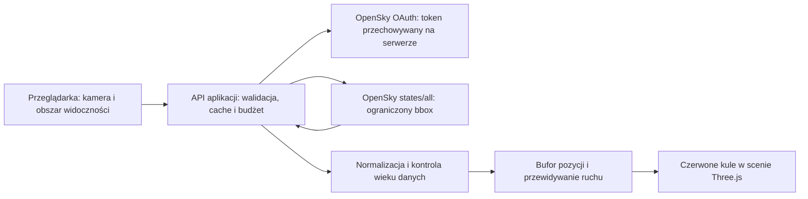

# Plan: rzeczywisty ruch OpenSky jako czerwone kule w świecie 3D

Data: **9 września 2026 r.**

Celem pierwszej wersji jest pokazanie rzeczywistych, poruszających się kontaktów lotniczych z OpenSky jako dużych czerwonych kul w świecie gry. Obiekt nadlatujący w okolice obserwatora powinien pojawić się w granicach widoczności sceny, poruszać płynnie i zniknąć po utracie aktualnych danych. Docelowe modele samolotów powstaną w kolejnym etapie.

**Status:** zaimplementowano backend OAuth, trwałą kontrolę kredytów, cache regionów, czerwone kule w scenie, predykcję ruchu, filtrowanie starych pozycji i jawny replay. Integracja działa lokalnie. Przygotowano kontener backendu i konfigurację frontendu dla zewnętrznego API; publiczny backend wymaga wskazania hostingu.

**Etap modeli:** dodano autorskie, uproszczone modele Boeing 737-800 oraz Airbus A320, dostępne w karuzeli pojazdów. Backend uzupełnia pozycje OpenSky metadanymi z adsbdb po `icao24`, sprawdzając zgodność zwróconego adresu Mode-S. Obsługiwane kody typu zastępują kule odpowiednim modelem; pozostałe kontakty zachowują kulę i znany typ w diagnostyce. Szczegóły wariantów, cache i limitów metadanych opisano w README. Poniższe sekcje planu opisują również pierwotny etap kul.

Weryfikacja tego etapu: test w Chromium potwierdził wybór obu modeli w menu, ich ruch w pełnej grze nad Warszawą i identyfikację modeli w replay. Prawdziwy odczyt adsbdb zwrócił `48c124 → B738 → SP-RKE` i `3c66a1 → A320 → D-AIUA`; oba typy zostały przypisane do właściwej geometrii. Powtarzalny ograniczony test: `node scripts/test-aircraft-metadata.mjs`. Dodatkowo sprawdzono przejście do gwiazd, Słońca i Księżyca powyżej 20 km oraz powrót widoku dziennego po zejściu; pełne przejście zajmuje zakres 20–22 km.

Po restarcie backendu test z prawdziwym OpenSky nad Warszawą zwrócił 7 świeżych kontaktów, w tym `46b8a9 → A320 → SX-NEI`, oraz poprawnie odróżnił `AS50`, `E75S` i `E195`. Trzy stare pozycje odrzucono. Pełny zestaw liczy obecnie 44 przechodzące testy; kompilacja produkcyjna także przechodzi.

### Weryfikacja implementacji

- 40 testów automatycznych przechodzi: autoryzacja i odnowienie tokenu na sterowanym zegarze, pojedyncza powtórka 401, 429, zachowanie budżetu po restarcie, wspólny cache, HTTP/CORS, parser, bieguny i południk 180°, transformacja globu, widoczność, ruch, timery i regresja istniejących kolizji/broni.
- `npm run build` przechodzi. Sprawdzono brak rzeczywistych wartości identyfikatora i sekretu OpenSky w plikach wynikowych frontendu.
- Test prawdziwego backendu nad Warszawą: dwa równoczesne żądania HTTP 200 dostały tę samą migawkę; jeden odczyt upstream / jeden kredyt w lokalnym rejestrze. Zwrócono 10 świeżych kontaktów, odrzucono 6 starych. Ostatni zaobserwowany nagłówek pozostałego budżetu wynosił 3994 — jest to zapis z chwili testu, nie bieżący licznik.
- Chromium: potwierdzono działanie natywnych timerów i fetch, przełączanie live/replay/off, renderowanie czerwonych znaczników i brak błędów strony. Naprawiono zgłoszony `Illegal invocation`: funkcje timerów muszą zachować kontekst `Window`.
- Pełna gra z rzeczywistą mapą Cesium nad Warszawą: 260 załadowanych kafli, działające kule replay, przełączanie sześciu kamer i pauza/wznowienie. Osobny test renderowania potwierdził zasłanianie znacznika przez geometrię w buforze głębokości.
- Nie wykonano wdrożenia na publiczny serwer, testu ciągłego 24/7 ani testu na fizycznym telefonie. Odnowienie tokenu i wyczerpanie limitu sprawdzono deterministycznie, bez celowego zużywania dziennej puli. Poniższy plan pozostaje specyfikacją oraz listą scenariuszy do dłuższego odbioru produkcyjnego.

## 1. Co potwierdził test API

Test wykonano przy użyciu `OPEN_SKY_CLIENT_ID` i `OPEN_SKY_CLIENT_SECRET` z lokalnego `.env`. Sekret i token pozostały poza raportem oraz kodem przeglądarki.

| Sprawdzenie | Wynik |
| --- | --- |
| Czas testu | 09.09.2026, około 13:37 czasu polskiego / 11:37 UTC |
| Uwierzytelnienie | OAuth2 `client_credentials`, HTTP 200 |
| Czas ważności tokenu | `expires_in = 1800` sekund |
| Endpoint | `GET /api/states/all` z bbox i `extended=1` |
| Obszar | Warszawa i okolice: `lamin=51.8`, `lomin=20.4`, `lamax=52.7`, `lomax=21.8` |
| Wielkość bbox | 1,26 stopnia kwadratowego; koszt katalogowy 1 kredyt na odczyt |
| Liczba odczytów | 2, w odstępie około 15 sekund |
| Statusy danych | HTTP 200 i HTTP 200 |
| Pozostałe kredyty z nagłówków | 3999 po pierwszym, 3998 po drugim odczycie |
| Liczba rekordów | 11, następnie 10; wszystkie z `on_ground=false` |
| Rekordy z pozycją i wysokością | 11, następnie 10; wszystkie miały `geo_altitude` |
| Pozycje nie starsze niż 30 s względem czasu odpowiedzi API | 7, następnie 6 |
| Ruch między próbkami | 10 wspólnych adresów ICAO; 6 otrzymało nową pozycję i przesunęło się o więcej niż 10 m |
| Najstarsza pozycja | 243 s w pierwszej i 260 s w drugiej odpowiedzi |
| Czas uzyskania nagłówków odpowiedzi | około 368 ms i 211 ms; nie jest to gwarantowane opóźnienie usługi |
| Różnica zegara lokalnego i czasu migawki API | około 5,3 s i 3,5 s |
| Kategoria statku powietrznego | Przeważnie 0 lub 1, czyli brak użytecznej klasyfikacji |

Test potwierdza autoryzację, dostęp do stanów, obecność potrzebnych współrzędnych, faktyczną zmianę pozycji oraz działanie nagłówka budżetu. **Nie potwierdza jeszcze renderowania, odświeżania tokenu po 30 minutach, działania 24/7 ani pokrycia całego świata.**

Najważniejszy wniosek: poprawne `HTTP 200`, obecność współrzędnych i `on_ground=false` nie wystarczają do uznania obiektu za aktualnie lecący. Trzeba niezależnie kontrolować `time_position`. W teście API zachowywało także stare pozycje w pobliżu lotniska.

Raport: [opensky-api-test-2026-09-09.json](opensky-api-test-2026-09-09.json).

Powtarzalny test, Node.js 22+:

```bash
node scripts/test-opensky.mjs --output=/private/tmp/flight-opensky-live-test.json
```

Skrypt wykonuje domyślnie dwa odczyty. Obsługuje `--samples=1`, `--interval=15`, `--bbox=lamin,lomin,lamax,lomax` i jawny tryb `--anonymous`. Ogranicza bbox do 25 stopni kwadratowych i liczbę odczytów do dwóch; po błędzie zatrzymuje się bez automatycznych powtórek ani przejścia na dostęp anonimowy. Raport lokalny może zawierać kilka przykładów publicznych kontaktów; raport w `docs` zawiera wyłącznie podsumowanie.

## 2. Co oznacza „samolot widoczny w OpenSky”

- Pokazujemy kontakty odebrane przez sieć OpenSky, z aktualną pozycją i wysokością. Sam włączony transponder nie gwarantuje pokrycia odbiornikami ani udostępnienia pozycji przez API.
- API nie dostarcza wiarygodnego przełącznika „transponder nadal włączony”. Utratę kontaktu rozpoznajemy po wieku danych.
- `icao24` jest identyfikatorem kontaktu. `callsign` może być pusty, zmienny lub powtarzalny; nie jest kluczem rekordu ani identyfikatorem modelu.
- Brak `squawk` nie wyklucza obiektu. `last_contact` nie zastępuje czasu ostatniej pozycji.
- Na etapie kul nie ograniczamy ruchu do naszych list producentów. Nieznany model nadal otrzymuje kulę. Przy nieznanej kategorii kontakt może okazać się np. śmigłowcem; nie należy udawać, że API zawsze potrafi rozróżnić rodzaj statku powietrznego.
- Obiekty mają rzeczywiste współrzędne i raportowaną wysokość. Wielkość czerwonej kuli jest celowo powiększonym znacznikiem, a nie rozmiarem samolotu.

## 3. Ustalenia dotyczące obecnej aplikacji

| Element | Stan obecny i znaczenie dla integracji |
| --- | --- |
| Silnik | Three.js oraz `3d-tiles-renderer`; główny widok obsługuje `src/main.js` |
| Pozycjonowanie | `WGS84_ELLIPSOID`, wysokość w metrach; następnie transformacja `tiles.group.matrixWorld` |
| Obrót mapy | `tiles.group.rotation.x = -Math.PI / 2`; pominięcie tej transformacji umieści ruch w złym miejscu |
| Gotowe wzorce | `frameAt()` i `flightPosition()` w `src/main.js` |
| Nieodpowiedni helper | `src/game/geo.js` obsługuje starszą lokalną, płaską scenę; nie używać go do pozycjonowania ruchu na globie |
| Widoczność | `FogExp2` o gęstości `0.00007`, perspektywa i przesłanianie przez teren |
| Kamera | `far=1e8` jest techniczną płaszczyzną obcinania, a nie sensownym zasięgiem pobierania danych |
| Kafelki | Ładowane według widoku, błędu ekranowego i cache; nie istnieje jeden stały „promień załadowanej mapy” |
| Tryby kamer | Chase, 3×, 5×, nose, fixed tracking i front; nieruchoma kamera może być daleko od pojazdu |
| Wdrożenie | Statyczna aplikacja Vite na GitHub Pages; obecnie brak serwera dla sekretu OpenSky |
| Mapa do testów wizualnych | `PUBLIC_MAP_LOCKED=true`; aplikacja oczekuje tokenu Cesium podanego w interfejsie. Sam klucz mapy w `.env` nie wystarczy w tym trybie |

**Decyzja:** ruch będzie osobną warstwą sceny, pozycjonowaną tak samo jak pojazd gracza. Widoczność oprzemy na kamerze i mgle. Załadowanie kafelka bezpośrednio pod samolotem nie będzie warunkiem jego istnienia, ponieważ obiekt może być widoczny wysoko nad bardziej odległym terenem.

## 4. Architektura pierwszej wersji



### Backend

1. Dodać mały serwis Node.js 22+, początkowo uruchamiany lokalnie obok Vite. Zachować osobny proces i te same zasady dla środowiska produkcyjnego.
2. Dodać endpoint aplikacji `GET /api/traffic?lat=...&lon=...&radiusKm=...`. Serwer sam buduje URL OpenSky; nie przyjmuje dowolnego URL ani dowolnych nagłówków do przekazania dalej.
3. W development ustawić proxy `/api` w Vite do serwisu lokalnego. W przeglądarce używać względnego adresu API.
4. W produkcji potrzebny jest backend poza GitHub Pages. Najprostszy wariant: jedna instancja Node za HTTPS; frontend pozostaje na Pages. Publiczny `VITE_TRAFFIC_API_BASE` może wskazywać tę usługę.
5. Docelowy hosting wybrać przed wdrożeniem. Kluczowe wymagania: sekrety serwerowe, współdzielony cache, kontrola budżetu i trwały zapis czasu blokady. Przy wielu instancjach konieczny jest wspólny koordynator lub magazyn, np. Redis.
6. Walidować zakres współrzędnych i maksymalny obszar. Ograniczyć częstotliwość żądań od klienta, liczbę nowych obszarów oraz całkowity koszt upstream. CORS nie zastępuje ochrony publicznego endpointu przed wyczerpaniem limitu.

### Token

- Czytać istniejące `OPEN_SKY_CLIENT_ID` i `OPEN_SKY_CLIENT_SECRET` wyłącznie na serwerze; nie zmieniać ich nazw na `VITE_*`.
- Pobierać token do oficjalnego endpointu OAuth, z formularzem URL-encoded.
- Zachowywać token w pamięci; wyznaczać termin ważności z odpowiedzi `expires_in`, odliczając zapas 60 s i czas wykonania żądania.
- Odświeżać przez ponowne `client_credentials`, a nie przez zakładany `refresh_token`.
- Łączyć równoczesne próby odświeżenia w jedną operację. To samo dotyczy równoczesnego pobierania tego samego bbox.
- Po 401 unieważnić token i wykonać najwyżej jedną próbę z nowym tokenem. Po ponownym błędzie zatrzymać próby do czasu kontrolowanego ponowienia.
- Nie logować sekretów, tokenów, nagłówków Authorization ani pełnej odpowiedzi OAuth. Nie przekazywać ich do klienta, localStorage, kodu `dist` ani raportów diagnostycznych.

### Kontrakt odpowiedzi aplikacji

Zwracać nazwane pola, a nie surowe tablice indeksowane z OpenSky:

```text
schemaVersion, snapshotTime, fetchedAt, serverTime, status,
nextPollAfterMs, coverageBboxes, isStale,
aircraft[]: {
  icao24, callsign, latitudeDeg, longitudeDeg,
  geoAltitudeM, baroAltitudeM, altitudeM, altitudeSource,
  timePosition, lastContact, onGround,
  velocityMps, trueTrackDeg, verticalRateMps,
  positionSource, category
}
```

`status` rozróżnia co najmniej `live`, `delayed`, `empty`, `rate-limited`, `unavailable` i `disabled`. Brak samolotów w poprawnej odpowiedzi nie oznacza błędu API. Diagnostyka serwera przechowuje faktyczny budżet; publiczna odpowiedź nie musi ujawniać szczegółów całego konta.

## 5. Obszar pobierania i widoczność kul

### Widoczność sceny

1. Po aktualizacji kamery wyznaczyć jej położenie geograficzne przez odwrotność transformacji świata mapy i elipsoidę WGS84. Centrum zapytań to **kamera**, co obsługuje również fixed tracking.
2. Wyprowadzić przybliżony zasięg z tej samej gęstości mgły: `R = sqrt(-ln(T)) / density`. Dla transmisji `T=0.05` i obecnej mgły jest to około **24,7 km**. To próg projektowy czytelności, a nie zmierzony promień kafelków.
3. Limitować renderowanie rzeczywistą odległością 3D od kamery, jej frustum i tym progiem. Jeśli mgła zostanie zmieniona lub wyłączona, zastosować jawny, konfigurowalny limit awaryjny zamiast `camera.far`.
4. Materiał kul respektuje mgłę i bufor głębokości. Teren i budynki przesłaniają kule. Dodać tani test zasłonięcia przez elipsoidę Ziemi, aby brak odległych kafelków nie ujawniał obiektów po drugiej stronie globu.
5. Kule są dziećmi osobnej grupy sceny. Nie dodawać ich do `tiles.group`, ponieważ raycasty kolizji, wysokości terenu i pocisków korzystają z tej grupy.

### Pobieranie z wyprzedzeniem

1. Pobierać bbox obejmujący całe otoczenie kamery, także za nią; obrót widoku nie powinien wymagać nowego żądania do OpenSky.
2. Domyślnie przyjąć promień pobierania **35 km**: około 25 km widoczności i 10 km bufora. Pozwala to otrzymać samolot jeszcze przed jego wejściem w widoczny obszar.
3. Wyznaczać bbox z rzeczywistego promienia na kuli/elipsoidzie. Nie używać stałego przelicznika długości geograficznej niezależnego od szerokości.
4. Dopasować granice do siatki cache i utrzymywać je, dopóki kamera pozostaje w wewnętrznej strefie pokrycia. Dodać histerezę oraz minimalny czas pomiędzy zmianami obszaru.
5. Wykorzystać istniejący cache zawierający żądany obszar. Łączyć bliskie obszary tylko wtedy, gdy nie powoduje to przekroczenia limitu powierzchni i budżetu.
6. Obsłużyć przecięcie południka 180° przez dwa prawidłowe bbox oraz zsumować koszt. Obsłużyć wysokie szerokości geograficzne bez dzielenia przez niemal zerowy cosinus.
7. Przy bardzo szybkim locie rakietą adaptacyjnie zwiększać bufor do skonfigurowanej granicy, ale nie zwiększać bez końca liczby zapytań. Po opuszczeniu pokrycia pokazać stan ładowania ruchu zamiast pozostawiać stare obiekty.
8. Każda zmiana sesji lub daleki teleport dostaje nowy identyfikator żądania. Anulować poprzedni fetch i ignorować spóźnione odpowiedzi ze starego obszaru; anulowanie nie cofa już zużytego kredytu.

## 6. Budżet 4000 kredytów dziennie

**4000 jest przydziałem dziennym, nie wartością inicjalnego salda.** Wartość rzeczywistą odczytywać z `X-Rate-Limit-Remaining` po odpowiedziach upstream. Brak nagłówka oznacza nieznane saldo, a nie 4000 ani zero.

Według dokumentacji koszt `/states/all` zależy od powierzchni bbox:

| Powierzchnia bbox | Kredyty / odczyt |
| --- | --- |
| do 25 stopni kwadratowych włącznie | 1 |
| ponad 25 do 100 | 2 |
| ponad 100 do 400 | 3 |
| ponad 400 lub cały świat | 4 |

| Interwał dla jednego bbox kosztującego 1 kredyt | Zużycie przez pełne 24 h |
| --- | --- |
| 10 s | 8640 — przekracza przydział |
| 15 s | 5760 — przekracza przydział |
| 30 s | 2880 |
| 60 s | 1440 |

**Domyślny interwał upstream: 30 s dla jednego aktywnego obszaru.** Płynność obrazu uzyskujemy przez ruch w każdej klatce, nie odpytywanie API co klatkę. Test diagnostyczny użył 15 s tylko przez dwa odczyty.

Niezbędne zasady:

- Cache o czasie świeżości około 30 s i jedna wspólna operacja upstream dla tego samego obszaru. Dziesięciu graczy w jednym miejscu ma współdzielić odczyt.
- Globalny harmonogram dla konta. Dwa różne obszary odpytywane stale co 30 s kosztowałyby 5760 kredytów dziennie; cache jednego regionu nie rozwiązuje kosztu całego świata.
- Sterownik budżetu uwzględnia wszystkie aktywne regiony, koszt bbox, aktualne saldo, planowany czas sesji i rezerwę np. 250 kredytów. Przy presji budżetowej wydłuża interwał, ogranicza przyjmowanie nowych obszarów lub wyłącza live; nie przedstawia bardzo starych danych jako bieżących.
- Pobierać dane tylko na aktywne zapotrzebowanie klientów. Wygaszać je po krótkim TTL, np. 60 s od ostatniego żądania klienta. Bez aktywnych widoków nie utrzymywać background pollingu.
- Po starcie serwera zachować ostatnie znane saldo/czas blokady z magazynu. Przy braku wiedzy dopuścić najwyżej kontrolowane żądanie rozpoznawcze, a nie równoczesne pobrania dla wielu regionów.
- Aktualizować saldo również przy błędach, jeśli występuje nagłówek. Różnice mogą odzwierciedlać inne skrypty używające tego samego konta.
- Po 429 respektować `X-Rate-Limit-Retry-After-Seconds`, następnie standardowy `Retry-After`. Zachować blokadę przez restart; przy braku nagłówków użyć rosnącego odstępu prób. Nie zakładać odnowienia salda o północy czasu lokalnego.
- Po timeoutach i 5xx stosować ograniczony backoff z losowym przesunięciem, bez równoległych pętli ponawiania. Po 403 zgłosić problem uprawnień.
- Dostęp anonimowy jest osobnym, jawnym trybem diagnostycznym. Nie przełączać się na niego automatycznie po wyczerpaniu konta.

## 7. Normalizacja danych i pozycjonowanie

### Pola OpenSky

| Indeks | Pole | Zastosowanie |
| --- | --- | --- |
| 0 | `icao24` | Klucz mapy kontaktów |
| 1 | `callsign` | Opcjonalna etykieta, po usunięciu spacji |
| 3 | `time_position` | Wiek i kolejność próbek pozycji |
| 4 | `last_contact` | Dodatkowa diagnostyka kontaktu |
| 5, 6 | `longitude`, `latitude` | Stopnie WGS84; sprawdzić kolejność |
| 7 | `baro_altitude` | Awaryjna wysokość barometryczna w metrach |
| 8 | `on_ground` | Odrzucić kontakty naziemne |
| 9 | `velocity` | Prędkość względem ziemi w m/s |
| 10 | `true_track` | Kierunek ruchu zgodnie z ruchem wskazówek od północy |
| 11 | `vertical_rate` | Prędkość pionowa w m/s |
| 13 | `geo_altitude` | Preferowana wysokość geometryczna w metrach |
| 16 | `position_source` | Źródło pozycji, np. ADS-B lub MLAT |
| 17 | `category` | Przybliżona kategoria z `extended=1`, często nieznana |

1. Odrzucać błędne rekordy, nieprawidłowy ICAO24, niepoprawne współrzędne, brak czasu pozycji, brak obu wysokości oraz `on_ground=true`. W pierwszej wersji wymagać jawnego `on_ground=false`.
2. Wartości zero są prawidłowe: sprawdzać typ i skończoność zamiast warunków typu `if (latitude)` lub `altitude || fallback`.
3. Używać `geo_altitude`; dopiero przy braku wartości używać `baro_altitude` z flagą niższej wiarygodności. Wysokość barometryczna nie jest tożsama z wysokością elipsoidalną; nie dodawać jej do wysokości terenu ani nie traktować jako AGL.
4. Zachować obie wysokości do diagnostyki. Brak danych nie może powodować umieszczenia kuli na wysokości zero. Unikać fikcyjnego „przyklejania” prawdziwych kontaktów do gruntu.
5. Przeliczyć stopnie na radiany, wywołać `WGS84_ELLIPSOID.getCartographicToPosition(lat, lon, altitude)` i zastosować dokładnie jedną transformację `tiles.group.matrixWorld`.
6. Wydzielić współdzielony helper z obecnego wzorca pozycjonowania, zamiast tworzyć konkurencyjny układ osi. Testować na realnych współrzędnych Ziemi, a nie tylko w pobliżu `(0,0,0)`.
7. Nie wymagać znanej kategorii. Jawne kategorie naziemnych pojazdów/przeszkód odrzucać; kategorie 0 i 1 dopuszczać.

## 8. Ruch, opóźnienia i znikanie obiektów

1. Utrzymywać po kilka ostatnich próbek dla każdego `icao24`, uporządkowanych według `time_position`. Odrzucać cofające się lub powtórzone próbki zamiast resetować nimi animację.
2. Opierać czas symulacji ruchu na zegarze serwera oraz upływie czasu monotonicznego w przeglądarce. `snapshotTime` nie jest czasem każdej pozycji; uwzględniać opóźnienie sieci i różnicę zegarów.
3. Gdy dwie próbki obejmują czas renderowania, interpolować. Między odczytami przewidywać przesunięcie z prędkości względem ziemi, `true_track` i prędkości pionowej.
4. Używać przesunięcia geograficznego/tangentnego zgodnego z elipsoidą, bez liniowej interpolacji długości geograficznej przez 180°. Kierunek jest kierunkiem ruchu, a nie zmierzoną orientacją nosa.
5. Po nadejściu nowszych danych łagodnie korygować pozycję, np. przez 1–2 s. Duże, fizycznie niewiarygodne skoki oznaczać jako przerwanie śladu, a nie animować lot przez pół mapy.
6. Brak prędkości lub kierunku: pozostawić ostatnią rzeczywistą pozycję z informacją o wieku, nie wymyślać lotu. Brak prędkości pionowej: nie ekstrapolować wysokości.
7. Początkowe progi do testów: nowy kontakt przyjmować z wiekiem pozycji maksymalnie 30 s; ekstrapolować najwyżej do wieku 30 s; następnie zatrzymać przewidywanie i oznaczyć opóźnienie; do 60 s wygasić/ukryć; po 90 s usunąć z cache klienta.
8. Wiek liczyć od źródłowego `time_position`. Powtórny odczyt tego samego starego rekordu nie odświeża TTL — to kluczowa poprawka wynikająca z testu API.
9. Dla zniknięcia z pojedynczej migawki zastosować ten sam limit świeżości, aby uniknąć migotania. Potwierdzone `on_ground=true`, wyjście daleko poza pokrycie lub nowa sesja mogą usuwać obiekt od razu.
10. Po pauzie lub wznowieniu karty nie nadrabiać ruchu poprzez wielki krok `dt`; pobrać świeże dane i zsynchronizować zegar.

Przy pollingu 30 s samolot lecący 250 m/s przebywa około 7,5 km między odczytami. Predykcja jest konieczna dla płynności, ale zwiększa błąd na zakrętach. HUD powinien odróżniać pozycję raportowaną od przewidywanej; nie jest to obraz radarowy gwarantujący dokładność w czasie rzeczywistym.

## 9. Czerwone kule i interfejs testowy

- Utworzyć warstwę `trafficRoot` z prostymi kulami, wspólną niskopoligonową geometrią i czerwonym materiałem. Rozważyć `InstancedMesh` przy większej liczbie kontaktów; zmiana reprezentacji nie może zmieniać danych śledzenia.
- Materiał: wyraźna czerwień, widoczna bez zależności od słońca, `fog=true`, `depthTest=true`; bez rysowania ponad terenem. Na początek bez cieni, świateł, efektów ognia i kolizji.
- Startowy promień wizualny około **75 m**, dostrajany testem. Zapewnić minimum około 10–12 pikseli średnicy dla odległego znacznika, ograniczyć maksymalny rozmiar ekranowy przy zbliżeniu i maksymalny promień świata, np. 250 m. Kamera nie może zostać przykryta wnętrzem ogromnej kuli.
- Wielkość ekranową przeliczać z FOV i wysokości viewportu, z identycznym zachowaniem na desktopie i telefonie. Na granicy widoczności kula ma zanikać razem z mgłą.
- Dodać przełącznik „Ruch na żywo” i krótki status: ładowanie, liczba widocznych kontaktów, wiek danych, brak ruchu, brak API lub wyczerpany limit.
- W trybie diagnostycznym pokazać liczbę pobranych, świeżych, odrzuconych i widocznych kontaktów, bbox, odstęp odczytów oraz opcjonalnie callsign/ICAO po wskazaniu kuli. Nie wymagać etykiet dla wszystkich obiektów.
- Przełącznik diagnostyczny „ostatnia pozycja / predykcja” pozwoli zobaczyć rzeczywistą różnicę między danymi API a animacją.
- Do prób wizualnych dodać odrębny tryb replay z jawnie oznaczonymi danymi testowymi. Nie udawać nimi danych live, gdy w danym miejscu nic nie leci.

## 10. Wpięcie w cykl gry

1. Inicjalizować kontroler ruchu po utworzeniu sceny i mapy, bez blokowania startu gry przy błędzie OpenSky.
2. Rozpoczynać pobieranie po ustaleniu miejsca startu i udostępnieniu widoku 3D. Na pierwszy test wybrać free flight w pobliżu Warszawy; następnie sprawdzić pozostałe tryby.
3. Po aktualizacji kamery aktualizować widoczność i animację, przed `renderer.render(scene, camera)`. Harmonogram HTTP działa osobno od `tickFrame()`.
4. Zatrzymywać zapotrzebowanie przy wyłączeniu ruchu, ukryciu karty, menu, pauzie, końcu rundy i ekranie zakrywającym widok 3D. Po wznowieniu użyć świeżej migawki.
5. Przy restarcie, zmianie miasta, nowej rundzie i dalekim teleportowaniu wyczyścić pozycje i unieważnić oczekujące odpowiedzi.
6. Multiplayer korzysta z tego samego backendu/cache; kule nie są zdalnymi graczami i nie przechodzą przez mechanikę `mp.mates`. Gracze oglądający ten sam rejon dostają tę samą wersję migawki.
7. Po opuszczeniu gry zwolnić timery, AbortControllery, słuchaczy, geometrię i materiały. Nie pozostawiać pętli zużywającej kredyty po zamknięciu widoku.

## 11. Kolejność implementacji i pliki

| Etap | Praca | Proponowane pliki | Warunek zakończenia |
| --- | --- | --- | --- |
| 0 — wykonany | Dokumentacja, audyt współrzędnych, 2 odczyty live | `scripts/test-opensky.mjs`, raport JSON i ten plan | HTTP 200, nagłówki budżetu, potwierdzony ruch i wykryta nieaktualność danych |
| 1 | Token manager i klient OpenSky z timeoutami | `server/openskyClient.mjs` | Token współdzielony i odnawiany; 401/403/429/5xx poprawnie obsłużone |
| 2 | Backend, cache obszarów, walidacja, globalny budżet | `server/trafficServer.mjs`, `server/trafficCache.mjs`, `server/trafficBudget.mjs` | Dwa żądania tego samego obszaru powodują jedno zapytanie upstream; limity działają dla różnych obszarów |
| 3 | Kontrakt i normalizacja danych | `shared/trafficState.js` | Odrzucane błędne, naziemne i stare rekordy; zachowane poprawne zera i braki opcjonalnych pól |
| 4 | Widoczność i konwersja geograficzna | `src/game/trafficVisibility.js`, współdzielony helper współrzędnych | Poprawne pozycje przy obrocie mapy, obu półkulach i wszystkich kamerach |
| 5 | Bufor śladów, interpolacja i predykcja | `src/game/trafficTracks.js` | Płynny ruch, limit predykcji i znikanie według źródłowego czasu |
| 6 | Kule i kontroler warstwy | `src/game/liveTraffic.js` | Widoczne czerwone kule, przesłanianie przez teren, brak wpływu na kolizje |
| 7 | Integracja cyklu gry, HUD i konfiguracja | `src/main.js`, `index.html`, `src/style.css`, `vite.config.js`, `package.json`, `.env.example` | Przełącznik, statusy, pauza, teleport i multiplayer działają |
| 8 | Testy offline, replay i krótki test live w grze | `tests/traffic*.test.js`, `tests/fixtures/traffic/` | Spełnione scenariusze poniżej; zmierzony koszt i wydajność |
| 9 | Backend produkcyjny i dokumentacja uruchamiania | Konfiguracja wybranego hostingu, README | HTTPS, sekrety serwerowe, budżet zachowany przez restart, możliwość wyłączenia funkcji |
| 10 — później | Modele z katalogów producentów | Katalog metadanych i renderer modeli | Model można zastąpić bez zmiany integracji API i śledzenia ruchu |

Etapy 1–8 tworzą lokalne MVP. Etap 9 jest wymagany przed udostępnieniem funkcji na obecnej stronie GitHub Pages. Wybór i publikacja infrastruktury nastąpią w ramach implementacji, po ustaleniu miejsca hostowania.

## 12. Testy i kryteria odbioru

### Automatyczne, bez kredytów OpenSky

- Mock zegara i HTTP: ważny token używany wielokrotnie, odnowienie przed wygaśnięciem, jedno odnowienie dla wielu żądań, pojedyncza powtórka po 401.
- Budżet: brak nagłówka, faktyczne saldo inne niż 4000, 429 z czasem ponowienia, restart podczas blokady, wiele regionów i użytkowników, różne koszty bbox.
- Cache: hit, wygasanie, deduplikacja równoczesnych pobrań, brak pollingu bez zapotrzebowania i ograniczenie liczby regionów.
- Parser: `states=null`, pusta tablica, uszkodzony rekord, współrzędne i wysokość zero, brak callsign/squawk/kategorii, brak wysokości, `on_ground=true`, stare i przyszłe znaczniki czasu.
- Geografia: stopnie/radiany, kolejność lat/lon, transformacja mapy dokładnie raz, południk 180°, okolice biegunów, kula pod horyzontem i kamera fixed tracking daleko od gracza.
- Ruch: prosty przelot, zakręt, wznoszenie, brak prędkości, odwrócona kolejność próbek, utrata kontaktu, ta sama stara pozycja w nowych odpowiedziach i powrót po przerwie.
- Cykl życia: brak aktywnych timerów po wyłączeniu, anulowanie po teleportowaniu, stara odpowiedź nie przywraca obiektów w nowym miejscu.
- Sprawdzenie produkcyjnego bundla pod kątem braku prawdziwego sekretu i tokenu, bez wypisywania ich wartości.

### Replay w scenie 3D

Przygotować mały deterministyczny zestaw fikcyjnych śladów: samolot nadlatujący z 35 km, przelot obok kamery, odlot, lot za górą/budynkiem, ślad ze starą pozycją i dwa kontakty o tym samym callsign. Tryb musi być oznaczony jako replay.

Sprawdzić: kule pojawiają się w tym samym obszarze widoczności co scena, są czytelne z daleka, nie prześwitują przez teren, nie zmieniają wysokości gracza i nie stają się celem kolizji/pocisków. Widok z dzioba, z przodu i nieruchoma kamera muszą działać tak samo jak chase.

### Krótki test live po implementacji

1. Uruchomić backend lokalnie i Vite. Upewnić się, że mapa 3D działa z prawidłowym tokenem Cesium.
2. Wybrać okolice Warszawy, uruchomić free flight i włączyć ruch.
3. Przeprowadzić sesję około 5 minut przy pollingu 30 s. Dla jednego bbox do 25 stopni kwadratowych oczekiwać około 10–11 odczytów, zależnie od momentu pierwszego pobrania; odchylenia wyjaśnić zmianami regionu lub powtórkami.
4. Porównać dane backendu, wiek próbki, przeliczoną pozycję i pozycję kuli dla kilku kontaktów. Jeśli korzystamy z witryny OpenSky jako kontroli, uwzględnić różny czas odświeżenia widoków.
5. Sprawdzić obiekt nadlatujący z bufora do widocznego obszaru oraz brak skoków przy kolejnych odpowiedziach. Jeśli ruch na żywo nie zapewnia danego scenariusza, zweryfikować go w replay zamiast czekać i zużywać kredyty.
6. Otworzyć drugiego klienta w tej samej okolicy: liczba żądań upstream nie powinna się podwoić. Następnie sprawdzić różne regiony i zadziałanie wspólnego budżetu.
7. Zatrzymać grę i potwierdzić ustanie pobrań po TTL zapotrzebowania. Nie wyczerpywać rzeczywistego budżetu celowo, aby testować 429.

### Wydajność i regresja

- Zmierzyć koszt warstwy dla 50, 200 i 500 sztucznych kontaktów bez dodatkowych żądań sieciowych. Dla typowego regionalnego ruchu cel: najwyżej około 2 ms dodatkowego czasu klatki na komputerze testowym; telefon ocenić na realnym urządzeniu.
- W razie przekroczenia budżetu zastosować instancing/pooling i limit najbliższych obiektów; nie utrzymywać nieograniczonej liczby meshów.
- Uruchomić `node --test tests/*.test.js` i `npm run build` po właściwej implementacji. Zweryfikować istniejące kamery, kolizje, broń, mapę oraz multiplayer.

## 13. Przygotowanie do prawdziwych modeli samolotów

Warstwa danych i ruchu nie powinna znać geometrii kuli. Udostępnić adapter wizualizacji: utworzenie reprezentacji, aktualizacja pozycji i orientacji oraz usunięcie zasobów.

W kolejnym etapie:

1. Uzyskać oddzielny katalog `icao24 → rejestracja / producent / model / ICAO type designator`. `/states/all` nie podaje dokładnego modelu, a kategoria nie wystarcza — potwierdził to także test.
2. Wybrać źródło metadanych i sprawdzić warunki jego wykorzystania; pobierać je okresowo i cache'ować, a nie wykonywać zapytania dla każdego kontaktu co 30 s.
3. Zamienić nasze listy Markdown na kontrolowany katalog modeli i aliasów. Uwzględnić m.in. CSeries/A220, Dash 8/Q400 i różnicę między 737-800 a 737 MAX 8.
4. Przypisać modele 3D, rozmiary i LOD. Dla nieznanych modeli zachować kulę lub model ogólny.
5. Orientację modelu przybliżać kierunkiem ruchu i prędkością pionową. API nie dostarcza pełnych danych pitch/roll; nie przedstawiać ich jako rzeczywiście zmierzonych.

**Pierwszy odbiór kończy się działającymi kulami i wiarygodną obsługą ruchu oraz limitów. Tworzenie szczegółowych modeli nie jest warunkiem przetestowania tej integracji.**

## Źródła

- [OpenSky REST API — autoryzacja, stany, pola, kredyty i nagłówki](https://openskynetwork.github.io/opensky-api/rest.html).
- [Wynik testu rzeczywistego API](opensky-api-test-2026-09-09.json).
- Kod projektu: `src/main.js`, `src/game/flightCamera.js`, `src/game/tileAuth.js`, `src/game/geo.js`, `.github/workflows/pages.yml`.
